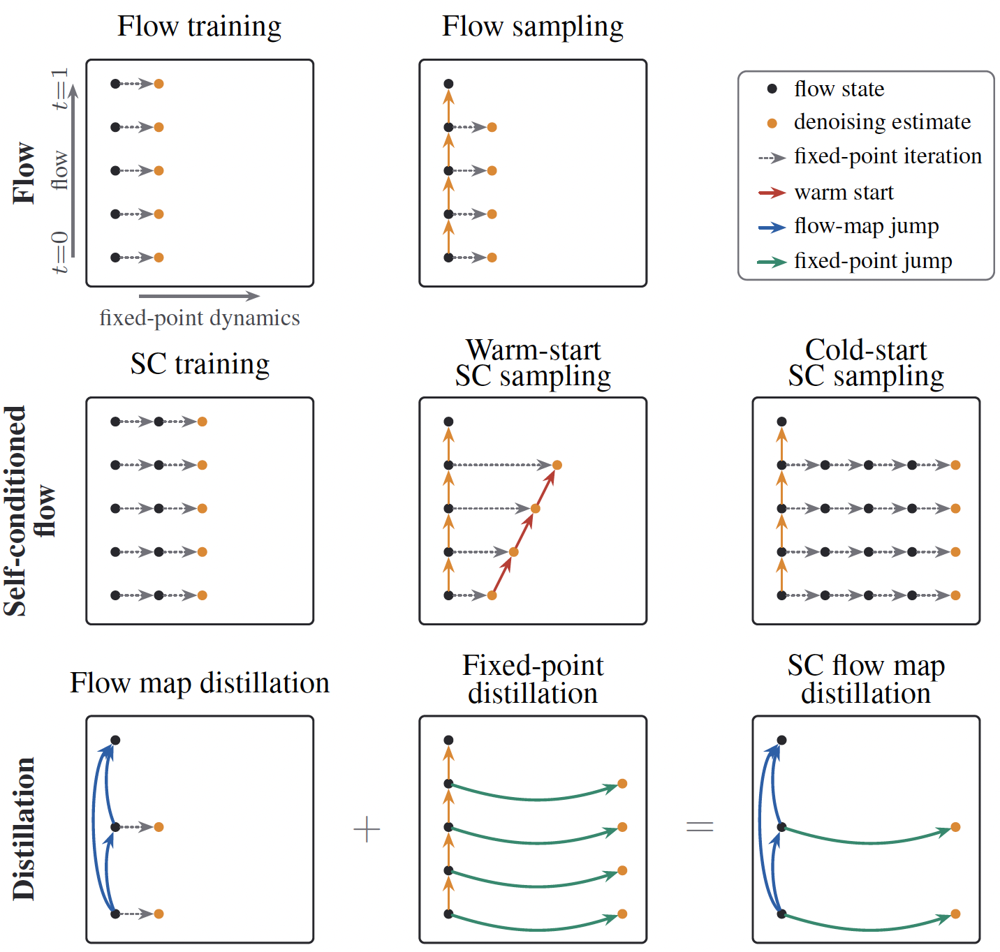

<div align="center">

# Self-Conditioned Flow Map Language Models via Fixed-Point Flows

**[Jaehoon Yoo](https://sites.google.com/view/jaehoon-yoo/홈)**<sup>1*</sup>, **[Wonjung Kim](https://github.com/wjhjkim)**<sup>1*</sup>, **[Floor Eijkelboom](https://flooreijkelboom.github.io/)**<sup>2</sup>, **[Chanhyuk Lee](https://david3684.github.io)**<sup>1</sup>, \
**[Nicholas M. Boffi](https://nmboffi.github.io/)**<sup>3</sup>, **[Seunghoon Hong](https://maga33.github.io/)**<sup>1†</sup>, **[Jinwoo Kim](https://jw9730.github.io/)**<sup>1†</sup>

<sup>1</sup>KAIST &nbsp; <sup>2</sup>University of Amsterdam &nbsp; <sup>3</sup>Carnegie Mellon University \
<sup>*</sup>Equal contribution &nbsp; <sup>†</sup>Equal advising

</div>

<div align="center">

[](https://arxiv.org/abs/2607.00714)
[](https://huggingface.co/wonjKim/self-conditioned-fmlm)
[](https://github.com/Ugness/self-conditioned-fmlm)

</div>

<div align="center">

</div>

Official PyTorch implementation of *Self-Conditioned Flow Map Language Models via Fixed-Point Flows*.

## News
- **[2026-07]** Released code and checkpoints for **ELF\***, and **FMLM\***.

## TL;DR

We show that flow language models with **self-conditioning** solve a **fixed-point iteration** that bootstraps the learned denoiser, formulate this as a **fixed-point flow**, and distill it into **FMLM\***, a flow map language model that outperforms state-of-the-art self-conditioned and few-step models in one- and few-step generation on OpenWebText.

## Overview

**Self-conditioning** enhances continuous flow-based language models by denoising text conditioned on the model's own estimate, but its improvements are poorly understood and hard to leverage for few-step generators based on **flow maps**. We show that flow language models with self-conditioning solve a **fixed-point iteration** that bootstraps the learned denoiser, and formulate this as a **fixed-point flow** — a two-dimensional class of self-conditioned flows spanning the flow process and the fixed-point iteration. Fixed-point flows define valid flow maps and are distilled by compressing both the fixed-point iterations and the flow process, yielding **FMLM\***, which outperforms state-of-the-art self-conditioned and few-step models in one- and few-step generation on OpenWebText.

### Models

| Stage | Model | Config | Distilled from |
| --- | --- | --- | --- |
| 1 | **ELF** — self-conditioned flow teacher | `train_owt_ELF-B_gpt2.yml` | — (trained from data) |
| 2 | **ELF\*** — self-conditioning-free fixed-point denoiser (CDEQ) | `train_owt_ELF_star.yml` | ELF (stage 1) |
| 3 | **FMLM\*** — few-step flow map (two-time denoiser) | `train_owt_FMLM_star.yml` | ELF\* (stage 2) |

All use the **ELF-B** backbone (12 layers, hidden 768, 12 heads, ~105M parameters).

## How to Run

### Install Dependencies

```bash
pip install -r requirements.txt
# or, for a full CUDA conda environment:
# conda env create -f environment.yml
```

FlashAttention is optional — it is enabled by `use_flash: true` in the configs. Set `use_flash: false` to run with the standard attention path.

### Data Preparation

**1. Tokenize OpenWebText with the GPT-2 BPE tokenizer** (packs to 1024 tokens per row, `[50256] + 1022 tokens + [50256]`):

```bash
cd pytorch_lightning/
python scripts/prepare_owt_gpt2_data.py \
    --out_dir ../dataset/openwebtext-gpt2-flm \
    --num_proc 4
```

This writes `../dataset/openwebtext-gpt2-flm/{train,valid}`, the `data_path` / `eval_data_path` wired into every training config.

**2. Estimate the encoder latent-normalization scalars** (`latent_mean`, `latent_std`) used to whiten the frozen GPT-2-Large latents:

```bash
python scripts/compute_gpt2_latent_stats.py \
    --data_path ../dataset/openwebtext-gpt2-flm/train \
    --num_samples 50000 --out_json gpt2_latent_stats.json
```

The configs already ship with the values for this dataset (`latent_mean: -0.009134`, `latent_std: 0.925011`); re-run this only if you change the dataset or encoder, then paste the printed values into the configs.

### Training

Train the three stages in order; each stage's checkpoint becomes the next stage's frozen teacher (`teacher_ckpt_path`, already pre-wired to the default `output_dir` of the previous stage). The paper trains each stage for 5 epochs with global batch size 512 on 8 GPUs.

**Stage 1 — ELF (self-conditioned flow teacher):**

```bash
torchrun --nproc_per_node=8 --master_port=29501 train_lightning.py \
    --config configs/training_configs/train_owt_ELF-B_gpt2.yml
# -> outputs/elf_b-gpt2/
```

**Stage 2 — ELF\* (self-conditioning-free, fixed-point distillation):**

```bash
torchrun --nproc_per_node=8 --master_port=29502 train_lightning.py \
    --config configs/training_configs/train_owt_ELF_star.yml
# teacher: stage-1 checkpoint; -> outputs/elf_star/
```

**Stage 3 — FMLM\* (fixed-point flow map distillation):**

```bash
torchrun --nproc_per_node=8 --master_port=29503 train_lightning.py \
    --config configs/training_configs/train_owt_FMLM_star.yml
# teacher: stage-2 checkpoint; -> outputs/fmlm_star/
```

### Evaluation

**ELF teacher** — stochastic SDE sampler (32 steps, w=3.0, γ=1.5):

```bash
torchrun --nproc_per_node=8 --master_port=29510 eval_lightning.py \
    --config configs/training_configs/train_owt_ELF-B_gpt2.yml \
    --checkpoint_path outputs/elf_b-gpt2/last.ckpt \
    --num_samples 1024 --sampling_method sde --num_sampling_steps 32 --sde_gamma 1.5 --self_cond_cfg_scales 3.0
```

**ELF\*** — fixed-point flow model (32 steps, w=3.0):

```bash
torchrun --nproc_per_node=8 --master_port=29511 eval_lightning.py \
    --config configs/training_configs/train_owt_ELF_star.yml \
    --checkpoint_path outputs/elf_star/last.ckpt \
    --num_samples 1024 --sampling_method cdeq --num_sampling_steps 32 --sde_gamma 0.0 --self_cond_cfg_scales 3.0
```

**FMLM\*** — flow-map γ-sampling (CTM-style; w=5.0, γ=0.75 for 2-step and γ=1.0 for 4-step):

```bash
torchrun --nproc_per_node=8 --master_port=29512 eval_lightning.py \
    --config configs/training_configs/train_owt_FMLM_star.yml \
    --checkpoint_path outputs/fmlm_star/last.ckpt \
    --num_samples 1024 --sampling_method ctm --num_sampling_steps 4 --sde_gamma 1.0 --self_cond_cfg_scales 5.0
```

`--checkpoint_path` must point at a local Lightning `.ckpt`. The EMA weights are swapped in automatically.

## Checkpoints

Pretrained **ELF**, **ELF\***, and **FMLM\*** checkpoints are available on [HuggingFace](https://huggingface.co/wonjKim/self-conditioned-fmlm).

| Stage | Model | Checkpoint |
| :---: | :--- | :--- |
| 1 | **ELF** — self-conditioned flow teacher | `elf.ckpt` |
| 2 | **ELF\*** — self-conditioning-free fixed-point denoiser | `elf_star.ckpt` |
| 3 | **FMLM\*** — few-step flow map | `fmlm_star.ckpt` |

Set `--checkpoint_path` (evaluation) or `teacher_ckpt_path` (distillation) to the downloaded checkpoint path when running the scripts above.

## Results

### FMLM\* vs. few-step language models

| Step | Metric | Duo · DCD | Duo · Di4C | MDLM · SDTT | MDLM · Di4C | FMLM | DFM · PSD | DFM · ESD | FMLM\* |
| :---: | :---: | :---: | :---: | :---: | :---: | :---: | :---: | :---: | :---: |
| 1 | gPPL ↓ | 5743.29 | 370.51 | 1260.86 | 1298.80 | 168.30 | 180.29 | 5.33 | **112.52** |
| 1 | entropy | 6.02 | 3.92 | 5.26 | 5.29 | 5.17 | 4.91 | 0.26 | 5.37 |
| 2 | gPPL ↓ | 891.16 | 210.22 | 877.22 | 758.23 | 133.29 | 152.83 | 108.91 | **94.74** |
| 2 | entropy | 5.41 | 4.63 | 5.34 | 5.35 | 5.25 | 5.03 | 5.15 | 5.45 |
| 4 | gPPL ↓ | 250.86 | 154.67 | 339.73 | 239.27 | 111.31 | 122.32 | 77.08 | **75.22** |
| 4 | entropy | 5.37 | 4.85 | 5.38 | 5.40 | 5.26 | 5.10 | 5.27 | 5.41 |


## BibTeX

If you find it useful, please cite:

```bibtex
@article{yoo2026selfconditioned,
    title={Self-Conditioned Flow Map Language Models via Fixed-Point Flows},
    author={Jaehoon Yoo and Wonjung Kim and Floor Eijkelboom and Chanhyuk Lee
            and Nicholas M. Boffi and Seunghoon Hong and Jinwoo Kim},
    journal={arXiv preprint arXiv:2607.00714},
    year={2026},
}
```

## Acknowledgements

This repository is built upon the codebases of **[ELF-pytorch](https://github.com/Ugness/ELF-pytorch)**, **[ELF](https://github.com/lillian039/ELF)**, and **[FMLM](https://github.com/david3684/flm)**.

## License

This repository is released under the MIT license. See [LICENSE](LICENSE) for details.
